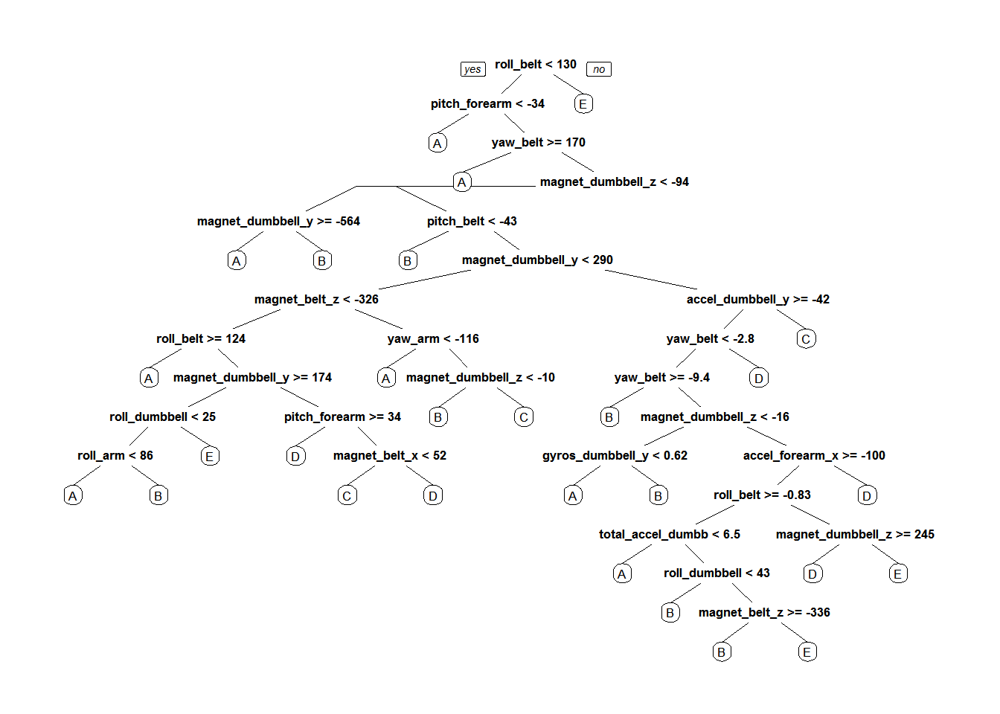

# Practical Machine Learning Project
Andrew Weston  
April 25, 2016  


##Summary
Using devices such as Jawbone Up, Nike FuelBand, and Fitbit it is now possible to collect personal exercise data in large quantities and very inexpensively. These type of devices are part of the quantified self movement – a group of enthusiasts who take measurements about themselves regularly to improve their health, to find patterns in their behavior, or because they are tech geeks. One thing that people regularly do is quantify how much of a particular activity they do, but they rarely quantify how well they do it. In this project, we will use data from accelerometers on the belt, forearm, arm, and dumbell of 6 participants  to predict the manner in which they did specific exercises.


The training data for this project are available here:
[https://d396qusza40orc.cloudfront.net/predmachlearn/pml-training.csv](https://d396qusza40orc.cloudfront.net/predmachlearn/pml-training.csv)

The test data are available here:
[https://d396qusza40orc.cloudfront.net/predmachlearn/pml-testing.csv](https://d396qusza40orc.cloudfront.net/predmachlearn/pml-testing.csv)

##Loading the data

```r
library(caret)
library(randomForest)
library(rpart)
library(rpart.plot)

traindata <- read.csv("pml-training.csv")
testdata  <- read.csv("pml-testing.csv")
```

Our goal is to predict the manner in which the subject performed the exercise (stored in the "classe" field). This is recorded as "A", "B", "C", "D" or "E." Participants were asked to perform one set of 10 repetitions of the Unilateral Dumbbell Biceps Curl in five different fashions: exactly according to the specification (Class A), throwing the elbows to the front (Class B), lifting the dumbbell only halfway (Class C), lowering the dumbbell only halfway (Class D) and throwing the hips to the front (Class E).

##Processing the Data

```r
colnames(traindata)
```

```
##   [1] "X"                        "user_name"               
##   [3] "raw_timestamp_part_1"     "raw_timestamp_part_2"    
##   [5] "cvtd_timestamp"           "new_window"              
##   [7] "num_window"               "roll_belt"               
##   [9] "pitch_belt"               "yaw_belt"                
##  [11] "total_accel_belt"         "kurtosis_roll_belt"      
##  [13] "kurtosis_picth_belt"      "kurtosis_yaw_belt"       
##  [15] "skewness_roll_belt"       "skewness_roll_belt.1"    
##  [17] "skewness_yaw_belt"        "max_roll_belt"           
##  [19] "max_picth_belt"           "max_yaw_belt"            
##  [21] "min_roll_belt"            "min_pitch_belt"          
##  [23] "min_yaw_belt"             "amplitude_roll_belt"     
##  [25] "amplitude_pitch_belt"     "amplitude_yaw_belt"      
##  [27] "var_total_accel_belt"     "avg_roll_belt"           
##  [29] "stddev_roll_belt"         "var_roll_belt"           
##  [31] "avg_pitch_belt"           "stddev_pitch_belt"       
##  [33] "var_pitch_belt"           "avg_yaw_belt"            
##  [35] "stddev_yaw_belt"          "var_yaw_belt"            
##  [37] "gyros_belt_x"             "gyros_belt_y"            
##  [39] "gyros_belt_z"             "accel_belt_x"            
##  [41] "accel_belt_y"             "accel_belt_z"            
##  [43] "magnet_belt_x"            "magnet_belt_y"           
##  [45] "magnet_belt_z"            "roll_arm"                
##  [47] "pitch_arm"                "yaw_arm"                 
##  [49] "total_accel_arm"          "var_accel_arm"           
##  [51] "avg_roll_arm"             "stddev_roll_arm"         
##  [53] "var_roll_arm"             "avg_pitch_arm"           
##  [55] "stddev_pitch_arm"         "var_pitch_arm"           
##  [57] "avg_yaw_arm"              "stddev_yaw_arm"          
##  [59] "var_yaw_arm"              "gyros_arm_x"             
##  [61] "gyros_arm_y"              "gyros_arm_z"             
##  [63] "accel_arm_x"              "accel_arm_y"             
##  [65] "accel_arm_z"              "magnet_arm_x"            
##  [67] "magnet_arm_y"             "magnet_arm_z"            
##  [69] "kurtosis_roll_arm"        "kurtosis_picth_arm"      
##  [71] "kurtosis_yaw_arm"         "skewness_roll_arm"       
##  [73] "skewness_pitch_arm"       "skewness_yaw_arm"        
##  [75] "max_roll_arm"             "max_picth_arm"           
##  [77] "max_yaw_arm"              "min_roll_arm"            
##  [79] "min_pitch_arm"            "min_yaw_arm"             
##  [81] "amplitude_roll_arm"       "amplitude_pitch_arm"     
##  [83] "amplitude_yaw_arm"        "roll_dumbbell"           
##  [85] "pitch_dumbbell"           "yaw_dumbbell"            
##  [87] "kurtosis_roll_dumbbell"   "kurtosis_picth_dumbbell" 
##  [89] "kurtosis_yaw_dumbbell"    "skewness_roll_dumbbell"  
##  [91] "skewness_pitch_dumbbell"  "skewness_yaw_dumbbell"   
##  [93] "max_roll_dumbbell"        "max_picth_dumbbell"      
##  [95] "max_yaw_dumbbell"         "min_roll_dumbbell"       
##  [97] "min_pitch_dumbbell"       "min_yaw_dumbbell"        
##  [99] "amplitude_roll_dumbbell"  "amplitude_pitch_dumbbell"
## [101] "amplitude_yaw_dumbbell"   "total_accel_dumbbell"    
## [103] "var_accel_dumbbell"       "avg_roll_dumbbell"       
## [105] "stddev_roll_dumbbell"     "var_roll_dumbbell"       
## [107] "avg_pitch_dumbbell"       "stddev_pitch_dumbbell"   
## [109] "var_pitch_dumbbell"       "avg_yaw_dumbbell"        
## [111] "stddev_yaw_dumbbell"      "var_yaw_dumbbell"        
## [113] "gyros_dumbbell_x"         "gyros_dumbbell_y"        
## [115] "gyros_dumbbell_z"         "accel_dumbbell_x"        
## [117] "accel_dumbbell_y"         "accel_dumbbell_z"        
## [119] "magnet_dumbbell_x"        "magnet_dumbbell_y"       
## [121] "magnet_dumbbell_z"        "roll_forearm"            
## [123] "pitch_forearm"            "yaw_forearm"             
## [125] "kurtosis_roll_forearm"    "kurtosis_picth_forearm"  
## [127] "kurtosis_yaw_forearm"     "skewness_roll_forearm"   
## [129] "skewness_pitch_forearm"   "skewness_yaw_forearm"    
## [131] "max_roll_forearm"         "max_picth_forearm"       
## [133] "max_yaw_forearm"          "min_roll_forearm"        
## [135] "min_pitch_forearm"        "min_yaw_forearm"         
## [137] "amplitude_roll_forearm"   "amplitude_pitch_forearm" 
## [139] "amplitude_yaw_forearm"    "total_accel_forearm"     
## [141] "var_accel_forearm"        "avg_roll_forearm"        
## [143] "stddev_roll_forearm"      "var_roll_forearm"        
## [145] "avg_pitch_forearm"        "stddev_pitch_forearm"    
## [147] "var_pitch_forearm"        "avg_yaw_forearm"         
## [149] "stddev_yaw_forearm"       "var_yaw_forearm"         
## [151] "gyros_forearm_x"          "gyros_forearm_y"         
## [153] "gyros_forearm_z"          "accel_forearm_x"         
## [155] "accel_forearm_y"          "accel_forearm_z"         
## [157] "magnet_forearm_x"         "magnet_forearm_y"        
## [159] "magnet_forearm_z"         "classe"
```
We have a tremendous number of variables to predict on, and would like to remove some of the less relevant ones (i.e. timestamp, subject name).


```r
#dump NA values
traindata <- traindata[, colSums(is.na(traindata)) == 0] 
testdata <- testdata[, colSums(is.na(testdata)) == 0] 

#dump the first 7 columns (not relevant to predictions)
traindata <- traindata[,8:length(names(traindata))]
testdata <- testdata[,8:length(names(testdata))]

dim(traindata)
```

```
## [1] 19622    86
```

```r
dim(testdata)
```

```
## [1] 20 53
```
We are predicting the value of `classe` so it is missing from the testdata. We would like to remove the other fields (columns) that are in traindata but not testdata, but save the `classe` column in traindata. In addition, testdata has a column called `problem_id` which does not exist in traindata so we will end up with the same number of columns in both data sets.

```r
classe <- traindata$classe
traindata <- traindata[,which(names(traindata) %in% names(testdata))]
traindata$classe <- classe
dim(traindata)
```

```
## [1] 19622    53
```
Now we are ready to split the training data 60/40 for training and validation respectively.

```r
set.seed(123)
rf_train <- createDataPartition(traindata$classe, p=0.60, list=F)
trainData <- traindata[rf_train, ]
testData <- traindata[-rf_train, ]
```
##Random Forest Model
We build a predictive model for recognizing which activity is being performed (the `classe` variable) via a Random Forest algorithm with 3-fold cross-validation. This is based on the general advice from course videos that seem to suggest Random Forest was almost always a reasonable choice (e.g. in Kaggle competitions) even if its not the best. We believe that it is reasonably accurate for the purposes of this project.


```r
rf_model <- train(classe ~., data = trainData, method = "rf", trControl = trainControl(method = "cv", number = 3), ntree = 25)
rf_model
```

```
## Random Forest 
## 
## 11776 samples
##    52 predictor
##     5 classes: 'A', 'B', 'C', 'D', 'E' 
## 
## No pre-processing
## Resampling: Cross-Validated (3 fold) 
## Summary of sample sizes: 7851, 7850, 7851 
## Resampling results across tuning parameters:
## 
##   mtry  Accuracy   Kappa    
##    2    0.9802140  0.9749661
##   27    0.9836958  0.9793744
##   52    0.9774120  0.9714262
## 
## Accuracy was used to select the optimal model using  the largest value.
## The final value used for the model was mtry = 27.
```
Now we need to test this model on the out-of-sample data (i.e. the other 40% of the original training data set).

```r
rf_predicted <- predict(rf_model, testData)
confusionMatrix(testData$class, rf_predicted)
```

```
## Confusion Matrix and Statistics
## 
##           Reference
## Prediction    A    B    C    D    E
##          A 2225    5    2    0    0
##          B   14 1488   11    4    1
##          C    0   10 1343   14    1
##          D    0    0   22 1261    3
##          E    0    2    7    8 1425
## 
## Overall Statistics
##                                          
##                Accuracy : 0.9867         
##                  95% CI : (0.984, 0.9892)
##     No Information Rate : 0.2854         
##     P-Value [Acc > NIR] : < 2.2e-16      
##                                          
##                   Kappa : 0.9832         
##  Mcnemar's Test P-Value : NA             
## 
## Statistics by Class:
## 
##                      Class: A Class: B Class: C Class: D Class: E
## Sensitivity            0.9937   0.9887   0.9697   0.9798   0.9965
## Specificity            0.9988   0.9953   0.9961   0.9962   0.9974
## Pos Pred Value         0.9969   0.9802   0.9817   0.9806   0.9882
## Neg Pred Value         0.9975   0.9973   0.9935   0.9960   0.9992
## Prevalence             0.2854   0.1918   0.1765   0.1640   0.1823
## Detection Rate         0.2836   0.1897   0.1712   0.1607   0.1816
## Detection Prevalence   0.2845   0.1935   0.1744   0.1639   0.1838
## Balanced Accuracy      0.9962   0.9920   0.9829   0.9880   0.9969
```

```r
postResample(rf_predicted, testData$classe)
```

```
##  Accuracy     Kappa 
## 0.9867448 0.9832329
```

```r
#out of sample error
1 - as.numeric(confusionMatrix(testData$classe, rf_predicted)$overall[1])
```

```
## [1] 0.01325516
```
Our out of sample error is about 1%, which is great since we heavily restricted the complexity of our random forest so it wouldn't take very long to compute.

##Prediction for the test data
Finally we use our model to determine the values of `classe` for the 20 rows of test data that were originally given.

```r
prediction <- predict(rf_model, testdata[,-length(names(testdata))])
prediction
```

```
##  [1] B A B A A E D B A A B C B A E E A B B B
## Levels: A B C D E
```


```r
tree <- rpart(classe ~ ., data=trainData, method="class")
prp(tree)
```


